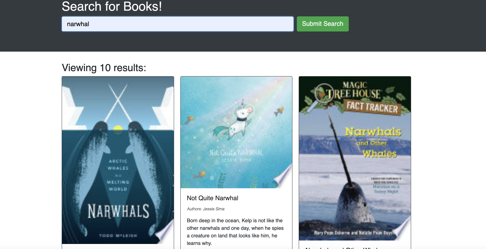

# Rosenblatt Book Search
## by Aaron Rosenblatt

### I refactored a starter code taking a fully functioning Google Books API search engine built with a RESTful API and made it a GraphQL API built with Apollo Server. The app was built using the MERN stack, with a React front end, MongoDB database, and Node.js/Express.js server and API. The code refactoring includes setting up an Apollo Server to use GraphQL queries and mutations to fetch and modify data, replacing the existing RESTful API, modifying the existing authentication middleware so that it works in the context of a GraphQL API, and creating an Apollo Provider so that requests can communicate with an Apollo Server. The application is deployed using Heroku. 

### When the user loads the page they can search for books. If the user submits a search, several results will return, each featuring a book’s title, author, description, image, and a link to that book on the Google Books site. Clicking on the login/signup menu option brings a modal that toggles between the option to log in or sign up. The signup option has inputs for username, email address, password and a signup button. The login option presents inputs for an email address, a password and a login button. When logged into the site, the menu options change to Search for Books, an option to see my saved books, and Logout. When the user is logged in and searches for a book, they are presented with several search results, each featuring a book’s title, author, description, image, and a link to that book on the Google Books site and a button to save a book to their account. If the user clicks on the Save button on a book, that book's information is saved to the account. When the user clicks on the option to view all the saved books, all the books that are saved to the account are displayed and each feature the book’s title, author, description, image, a link to that book on the Google Books site and a button to remove a book from my account. When a user clicks on the Remove button on a book then that book is deleted from the saved books list. Finally, when a user clicks on the logout button they are logged out of the site and presented with a menu with the options Search for Books, Login/Signup and an input field to search for books and a submit button.

### The Rosenblatt Book Search can be viewed here: https://blatt-booksearch.herokuapp.com/

### The GitHub repository for Rosenblatt Book Search can be viewed here: https://github.com/noplur/book-search

### Here is a screenshot of a sample from Rosenblatt Book Search:
### 